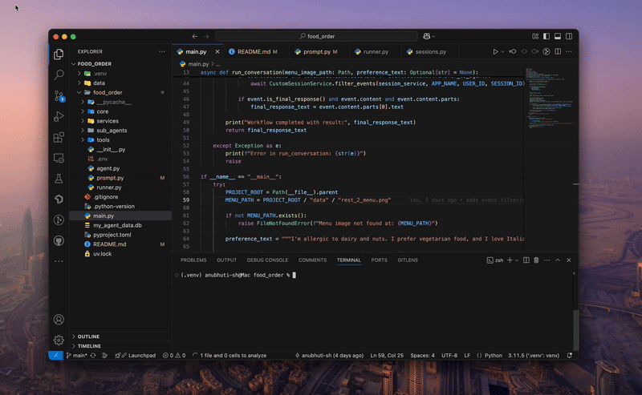

# Food Order AI Agent

This project is an AI-powered food ordering assistant that processes restaurant menu images and user preferences to suggest suitable dishes. It leverages OCR, LLMs, and a modular agent-based workflow.

## Demo


## Features

- Extracts dish names and prices from menu images using OCR.
- Understands user dietary preferences and restrictions.
- Enriches dish information (ingredients, calories, tags).
- Suggests dishes based on menu and user preferences.
- Modular agent/sub-agent architecture for extensibility.
- Custom session management for user conversations.
- Callback hooks for agent and tool execution logging.

## Project Structure

```
food_order/
├── main.py
├── food_order/
│   ├── agent.py
│   ├── runner.py
│   ├── core/
│   ├── prompt.py
│   ├── services/
│   ├── sub_agents/
│   └── tools/
└── data/
    └── rest_2_menu.png
```

## Setup

1. **Clone the repository**  
   ```
   git clone <repo-url>
   cd food_order
   ```

2. **Install dependencies**  
   Ensure you have Python 3.8+ and install required packages:
   ```
   pip install -r requirements.txt
   ```

3. **Configure environment**
   - Create a `.env` file inside the food_order folder same as `.env.example` and put your key openAI key there 
   - Place your menu image in `data/rest_2_menu.png` or update the path in `main.py`.
   - Set up any required API keys for Google ADK, LiteLLM, or OCR tools as needed.

## Usage

Run Using adk-web:
```
adk web
```

or

Run the main script:

```
python main.py
```

You can modify the user preference text in `main.py` to test different scenarios.

### Notes

- The system uses a custom session service (`CustomSessionService`) for managing user sessions.
- Agent and tool callbacks are used for logging and can be customized in `food_order/tools/callbacks/`.
- The menu image and user preferences are both required for the workflow.

## Customization

- **Agents and Tools:**  
  Add or modify agents in `food_order/sub_agents/` and tools in `food_order/tools/` to extend functionality.

- **Prompts:**  
  Update prompt templates in `food_order/prompt.py` for different extraction or enrichment logic.

- **Callbacks:**  
  Customize agent and tool callbacks for logging or side effects in `food_order/tools/callbacks/`.

## License

MIT License

## Acknowledgements

- [Google ADK](https://github.com/google/adk)
- [LiteLLM](https://github.com/BerriAI/litellm)
- [Tesseract OCR](https://github.com/tesseract-ocr/tesseract)